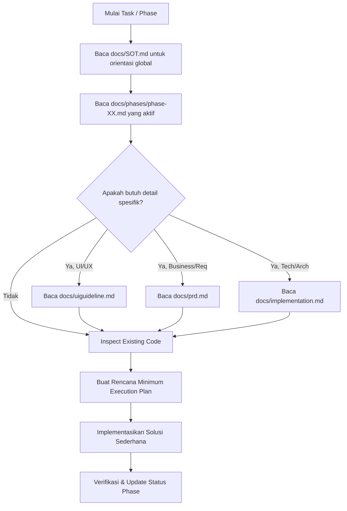

# AI Coding Agent Operating Manual (AGENTS.md)

Dokumen ini adalah pedoman operasional wajib bagi semua AI Coding Agent (Codex, Ponytail, Antigravity, dll.) yang bekerja di repositori ini. Setiap instruksi di bawah ini bersifat mengikat demi menjaga konsistensi, efisiensi context token, dan arsitektur anti-overengineering.

---

## 1. Golden Rules
1. **Single Source of Truth (SSOT)**: Jangan menduplikasi aturan antar dokumen. Rujuk dokumen otoritatif yang relevan.
2. **Strict Context Efficiency**: Muat HANYA dokumen yang diperlukan untuk phase aktif. Jangan membaca seluruh folder `docs/` sekaligus jika tidak dibutuhkan.
3. **Anti-Overengineering**: 
   - Gunakan solusi paling sederhana yang memenuhi *acceptance criteria*.
   - Jangan menambahkan library/dependency baru tanpa konfirmasi dan justifikasi nyata.
   - Jangan membuat abstraksi/layer baru (generics rumit, multi-level wrappers, premature optimization) untuk skenario yang belum ada.
   - Prioritaskan *native code* dan *existing components/utilities*.
4. **Frontend Scope Boundary**:
   - Repositori ini adalah **Frontend Client Only**.
   - Jangan membuat backend runtime / custom database engine.
   - Semua panggilan API diarahkan ke mock service layer dengan anotasi: `// TODO: replace with real API`.
5. **No Code Without Active Phase**: Jangan menulis kode fitur di luar cakupan `phase-XX.md` yang sedang aktif.

---

## 2. Pre-Coding Workflow
Sebelum membuat atau mengubah kode pada setiap fase:

1. **Check SOT**: Pahami status terkini di [SOT.md](file:///c:/Users/mammu/portal-bendahara/docs/SOT.md).
2. **Read Active Phase**: Buka file phase aktif `docs/phases/phase-XX.md`.
3. **Targeted Reading**: Baca HANYA file pendukung yang direferensikan dalam phase tersebut.
4. **Inspect Existing Code**: Cek komponen, utility, dan type yang sudah ada sebelum membuat yang baru.
5. **Draft Plan**: Rancang eksekusi minimalis yang langsung menyelesaikan acceptance criteria.

---

## 3. Context Loading Protocol (Hemat Token)
Gunakan routing berikut untuk menentukan dokumen yang harus dibaca:

| Kebutuhan Agent | File Wajib Dibaca | File Opsional | DILARANG Dibaca |
| :--- | :--- | :--- | :--- |
| Orientasi Awal / Check Phase | `docs/SOT.md` | - | Seluruh phase lain |
| Implementasi Phase Aktif | `AGENTS.md`, `docs/SOT.md`, `docs/phases/phase-XX.md` | Dokumen rujukan di phase (PRD/UI/Impl) | Phase yang sudah selesai / belum mulai |
| Penyesuaian UI & Layout | `docs/uiguideline.md` | - | `docs/implementation.md` |
| Validasi Logika Bisnis & Role | `docs/prd.md` | - | `docs/uiguideline.md` |
| Integrasi API & Mock Data | `docs/implementation.md` | - | `docs/uiguideline.md` |

---

## 4. Implementation & Coding Rules
- **Format Finansial**: Semua nominal wajib diformat Rupiah (`Rp1.000.000`, bukan `1000000` atau `Rp 1.000.000,-`). Gunakan utility terpusat `formatRupiah()`.
- **Format Tanggal**: Format Indonesia (`DD/MM/YYYY` atau `12 Agustus 2026`). Gunakan utility terpusat `formatDate()`.
- **Financial Validation**:
  - Modal konfirmasi wajib muncul sebelum mutasi saldo / pembayaran SPP.
  - Saldo kantin tidak boleh bernilai negatif (`saldo >= 0`).
  - Nominal top up minimal `Rp50.000`.
- **Access Control / Role Boundary**:
  - Siswa: Hanya lihat saldo & histori kantin sendiri.
  - Orang Tua: Hanya lihat/kelola data anak sendiri (SPP & Kantin).
  - Admin/TU: Akses rekap global SPP, pengeluaran sekolah, dan monitoring kantin.
- **State & Data**:
  - Tidak ada *hardcoded mock* di dalam komponen tampilan.
  - Semua data diambil melalui service adapter / custom hooks mock.

---

## 5. Anti-Overengineering Checklist
Sebelum men-submit file/fitur, pastikan:
- [ ] Apakah ada komponen atau fungsi serupa yang bisa di-reuse?
- [ ] Apakah ada library pihak ketiga baru yang tidak esensial? (Jika ada, hapus dan gunakan *vanilla/native*).
- [ ] Apakah ada tipe TypeScript atau interface yang berlebihan / tidak pernah dipakai?
- [ ] Apakah state management dibuat sesederhana mungkin (Local State / Context API tanpa library kompleks)?
- [ ] Apakah struktur file tetap flat dan mudah dipahami?

---

## 6. Verification & Definition of Done (DoD)
Setiap phase dinyatakan selesai jika:
1. Semua **Acceptance Criteria** pada `phase-XX.md` terverifikasi.
2. Tidak ada error build, TypeScript error, atau console runtime error.
3. Tampilan responsif pada ukuran Mobile (360px–428px) dan Desktop (1024px+).
4. Status pada `phase-XX.md` diubah menjadi `COMPLETED` dan `docs/SOT.md` diperbarui ke phase berikutnya.
