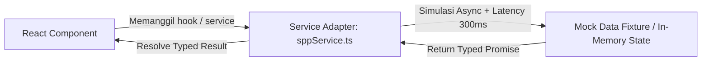

# Technical Implementation Plan & Architecture

Dokumen ini menjelaskan aspek teknis arsitektur (*HOW*), standar kode, struktur folder, dan pola data flow untuk Portal Keuangan Sekolah.

---

## 1. Technology Stack & Baseline Decisions

| Layer / Kebutuhan | Teknologi Terpilih | Justifikasi Teknis |
| :--- | :--- | :--- |
| **Framework / Bundler** | React + Vite (TypeScript) | Sangat cepat, ringan, efisien context AI, tanpa overhead server runtime (cocok untuk SPA Frontend-Only). |
| **Styling Engine** | Tailwind CSS v3/v4 | Efisien, modular, utility-first, performa tinggi, dan mudah mengadaptasi design tokens. |
| **Icon Library** | Lucide React | Modern, clean, konsisten, dan *tree-shakeable*. |
| **Routing** | React Router DOM (v6/v7) | Standar industri client-side routing dengan layout & protected route wrapper. |
| **State Management** | React Context (Auth/Session) + Local State | Cukup, ringan, tanpa overhead library kompleks seperti Redux/Zustand di fase awal. |
| **Mock Service Layer** | In-Memory Typed Service Adapters | Mensimulasikan network latency (200-400ms), typed contract, anotasi: `// TODO: replace with real API`. |

---

## 2. Directory Structure & Code Organization

```
portal-bendahara/
├── docs/                      # Dokumentasi Modular & SOT
│   ├── SOT.md
│   ├── prd.md
│   ├── uiguideline.md
│   ├── implementation.md
│   └── phases/
│       ├── phase-01.md
│       ├── phase-02.md
│       ├── phase-03.md
│       ├── phase-04.md
│       ├── phase-05.md
│       └── phase-06.md
├── src/
│   ├── assets/                # Gambar, logo sekolah, static assets
│   ├── components/            # Reusable Presentational UI Components
│   │   ├── common/            # Button, Badge, Input, Modal, Skeleton, Toast
│   │   ├── layout/            # Navbar, Sidebar, BottomNav (mobile), Header
│   │   └── cards/             # TransactionCard, BalanceStatCard, QRCard
│   ├── context/               # Global State (AuthContext, ToastContext)
│   ├── features/              # Feature-based Pages & Feature-specific Components
│   │   ├── auth/              # LoginPage, RoleSwitcher
│   │   ├── spp/               # SPPDashboard, PaymentModal, HistorySPP, ExpensesList
│   │   ├── canteen/           # CanteenDashboard, TopUpModal, QRScannerModal, MutationHistory
│   │   ├── canteenStaff/      # CanteenStaffDashboard (POS Kasir, Loket Top-Up, Mutasi Kasir)
│   │   └── admin/             # AdminOverview, ExpenseManagement, CanteenMonitoring
│   ├── services/              # API & Service Adapters (Backend & Fallback)
│   │   ├── apiClient.ts       # Central HTTP Client dengan Auth Bearer Header
│   │   ├── authService.ts     # POST /api/staff/login, /api/staff/me, /api/staff/logout
│   │   ├── sppService.ts      # Modul SPP & Rekapitulasi
│   │   ├── canteenService.ts  # /api/staff/save-money/* (Init, Store, History)
│   │   └── expenseService.ts  # /api/staff/belanja/* (Recent, Stats, Store)
│   ├── data/                  # Realistic Seed / Mock Data Fixtures
│   │   ├── mockUsers.ts
│   │   ├── mockSPP.ts
│   │   ├── mockCanteen.ts
│   │   └── mockExpenses.ts
│   ├── types/                 # Shared TypeScript Interfaces / Types
│   │   ├── auth.ts
│   │   ├── spp.ts
│   │   ├── canteen.ts
│   │   └── common.ts
│   ├── utils/                 # Utility Functions (Pure Functions)
│   │   ├── formatters.ts      # formatRupiah(), formatDate()
│   │   └── validators.ts      # validateTopUp(), validateBalance()
│   ├── App.tsx                # App Entry, Route Definition & Providers
│   ├── index.css              # Tailwind Directives & Custom Global Styles
│   └── main.tsx               # DOM Mounting
├── package.json
├── tsconfig.json
└── vite.config.ts
```

---

## 3. Data Flow & Mock Service Pattern

Semua panggilan data frontend wajib melalui service adapter, tidak langsung mengakses array mock di dalam komponen.



### Pola Penulisan Service:
```typescript
// src/services/sppService.ts
// TODO: replace with real API endpoint: /api/v1/spp/bills
import { mockSPPBills } from '../data/mockSPP';
import { SPPBill } from '../types/spp';

export const getSPPBillsByStudentId = async (studentId: string): Promise<SPPBill[]> => {
  // Simulasi latency jaringan
  await new Promise((resolve) => setTimeout(resolve, 300));
  return mockSPPBills.filter((bill) => bill.studentId === studentId);
};
```

---

## 4. Standard Formatters & Pure Utilities

### 4.1. Currency Formatter (`src/utils/formatters.ts`)
```typescript
export const formatRupiah = (amount: number): string => {
  return new Intl.NumberFormat('id-ID', {
    style: 'currency',
    currency: 'IDR',
    minimumFractionDigits: 0,
    maximumFractionDigits: 0,
  }).format(amount).replace(/\s/g, ''); // Mengubah "Rp 1.000.000" -> "Rp1.000.000"
};
```

### 4.2. Date Formatter (`src/utils/formatters.ts`)
```typescript
export const formatDate = (dateString: string, style: 'short' | 'long' = 'short'): string => {
  const date = new Date(dateString);
  if (isNaN(date.getTime())) return dateString;
  
  if (style === 'long') {
    return new Intl.DateTimeFormat('id-ID', {
      day: 'numeric',
      month: 'long',
      year: 'numeric',
    }).format(date);
  }
  
  return new Intl.DateTimeFormat('id-ID', {
    day: '2-digit',
    month: '2-digit',
    year: 'numeric',
  }).format(date);
};
```

---

## 5. Security & Session Handling
- **Mock Session Storage**: Token disimpan di dalam in-memory state (`AuthContext`) atau `sessionStorage` mock sederhana.
- **Role Route Guard**: Komponen `<ProtectedRoute allowedRoles={['admin', 'parent']} />` membungkus setiap rute navigasi.
- **Sanitasi Input**: Seluruh input teks dan form diverifikasi sebelum diteruskan ke service mock.

---

## 6. Anti-Overengineering Guardrails
1. **No External State Manager**: Jangan menambahkan Redux, MobX, atau Zustand kecuali state global terbukti tidak dapat ditangani oleh React Context.
2. **No CSS-in-JS Runtime**: Gunakan utility Tailwind CSS murni.
3. **No Heavy Form Libraries**: Gunakan controlled standard React form state untuk form sederhana.
4. **No Premature Abstraction**: Jangan membuat *wrapper utility* jika fungsi native browser / JS standar (`Intl`, `Array.filter`, `setTimeout`) sudah cukup.
