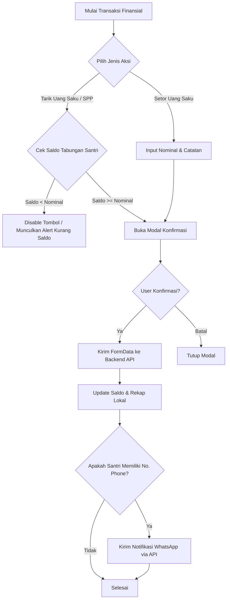

# Product Requirements Document (PRD)

## 1. Product Background & Problem Statement
Sekolah berasrama (*boarding school*) dan pesantren menghadapi tantangan finansial harian pada tiga pilar utama:
1. **Penagihan & Pelunasan SPP 12 Bulan**: Rekonsiliasi manual tagihan SPP bulanan, kebutuhan transparansi status bayar santri per tahun ajaran, serta keterlambatan pembayaran akibat minimnya notifikasi langsung ke orang tua.
2. **Pengelolaan Saldo Tabungan & Rekening Santri**: Memisahkan alur titipan uang saku tunai harian santri di loket bendahara dengan setoran dana SPP santri yang masuk via transfer Virtual Account Bank (VA).
3. **Belanja Santri Cashless di Kantin / Koperasi**: Menghilangkan risiko kehilangan uang tunai fisik santri dan mempercepat pencatatan kasir POS belanja santri.

**Solusi**: Aplikasi web terpadu Portal Bendahara yang mendigitalisasi penagihan & pelunasan SPP otomatis (via pemotongan saldo tabungan), pengelolaan tabungan santri, kasir belanja santri, serta pengiriman notifikasi WhatsApp otomatis ke wali santri via Evolution API.

---

## 2. Target Personas & Role Matrix

| Role | Backend Role ID / Endpoint | Kebutuhan Utama | Batasan Akses |
| :--- | :--- | :--- | :--- |
| **Admin / Bendahara TU** (`admin`) | Role 1, 2, 4 (`/api/staff/save-money/*`, `/api/staff/whatsapp/send`) | Rekapitulasi SPP 12 bulan santri, eksekusi pemotongan saldo untuk pelunasan SPP, input setoran uang saku, penarikan uang saku santri, dan laporan belanja | Akses administratif penuh ke seluruh modul keuangan |
| **Staff Kasir / Kantin** (`canteen_staff`) | Role 3 (`/api/staff/belanja-santri/*`) | Transaksi POS kasir belanja santri, pencarian santri via NISN/nama, rekap belanja harian | Fokus pada transaksi belanja santri dan riwayat kasir |
| **Orang Tua / Wali** (`parent`) | Wali Santri | Menerima notifikasi WhatsApp setiap mutasi tabungan & pelunasan SPP, melakukan transfer SPP ke Bank VA | Notifikasi otomatis ke nomor WhatsApp yang terdaftar |
| **Siswa / Santri** (`student`) | Role 0 | Transaksi belanja santri di kantin, mutasi saldo uang saku | Data saldo dan riwayat pribadi |

---

## 3. Functional Requirements

### 3.1. Modul Autentikasi & Session
- **FR-AUTH-01**: Login terintegrasi Backend API (`POST /api/login`) dengan token Bearer Session.
- **FR-AUTH-02**: Otomatis memuat profil pengguna aktif via `GET /api/user`.
- **FR-AUTH-03**: Role guard pada setiap menu navigasi dengan fallback sesi aman.

### 3.2. Modul Rekap & Pelunasan SPP 12 Bulan
- **FR-SPP-01**: Tampilan matriks rekapitulasi SPP 12 bulan (Juli s/d Juni) untuk setiap santri.
- **FR-SPP-02**: Ketentuan Tahun Ajaran (*Thang*):
  - Format `thang`: `{tahun_awal}_{semester}` (contoh `2025_1`, `2025_2`, `2026_1`, `2026_2`).
  - SPP dihitung 12 bulan penuh berbasis `baseYear` (tahun awal dari `thang`).
- **FR-SPP-03**: Penentuan Status Bulan SPP:
  - `Lunas` (🟢): Terdapat transaksi penarikan saldo tabungan bertag `spp` (`kategori: "0"` / `Mengambil (-)`).
  - `Menunggak` (🔴): Bulan tagihan yang telah lewat masa jatuh tempo (tanggal 10) namun belum dibayar.
  - `Belum Jatuh Tempo` (⚪): Bulan tagihan di masa mendatang.
- **FR-SPP-04**: Metode Pembayaran Tunggal:
  - Pelunasan SPP di Dashboard SPP dikunci murni pada **Potong Saldo Tabungan Santri** (`kategori: "0"`).
  - Sistem menampilkan saldo tabungan terkini santri, nominal SPP, dan estimasi sisa saldo.
  - Tombol simpan otomatis **Disabled** jika saldo tabungan santri tidak mencukupi.

### 3.3. Modul Tabungan & Rekening Santri
- **FR-TAB-01**: Sinkronisasi saldo riil santri dari mutasi API `GET /api/staff/save-money/init`.
- **FR-TAB-02**: Setoran Uang Saku Santri (+):
  - Form Setor (+) admin difokuskan murni untuk setoran uang saku titipan wali santri di loket bendahara.
  - Top-up SPP dialihkan murni via integrasi transfer Bank VA santri.
- **FR-TAB-03**: Penarikan Saldo Santri (-):
  - Opsi penarikan uang saku tunai santri.
  - Opsi penarikan untuk pelunasan SPP santri.
  - Validasi saldo tidak boleh negatif (`saldo >= nominal_penarikan`).

### 3.4. Modul Belanja Santri (POS Kasir)
- **FR-BLJ-01**: Kasir belanja santri terintegrasi `POST /api/staff/belanja-santri/store`.
- **FR-BLJ-02**: Pencarian cepat santri via NISN, Nama, atau Filter Kelas.
- **FR-BLJ-03**: Input nominal belanja, verifikasi kecukupan saldo santri, dan pencatatan riwayat transaksi belanja.

### 3.5. Modul Notifikasi WhatsApp Otomatis
- **FR-WA-01**: Integrasi endpoint `POST /api/staff/whatsapp/send` via Evolution API.
- **FR-WA-02**: Nomor tujuan diambil secara dinamis dari properti `phone` user JSON santri (format: `08xxx`, `628xxx`, atau `+62xxx`).
- **FR-WA-03**: Notifikasi otomatis dikirimkan setiap:
  1. Setoran Uang Saku (+) berhasil dicatat.
  2. Penarikan Uang Saku (-) berhasil dicatat.
  3. Pelunasan SPP bulanan via Potong Saldo berhasil dicatat.
- **FR-WA-04**: Format pesan profesional mencantumkan nama santri, NISN, nominal, rincian sisa saldo, waktu transaksi, dan ucapan resmi.

---

## 4. Business Logic & Validation Rules

1. **Aturan Saldo Tabungan**: Saldo tabungan santri tidak boleh bernilai negatif (`saldo >= 0`). Transaksi penarikan/pemotongan SPP ditolak jika saldo tidak mencukupi.
2. **Kategori Sirkulasi API**:
   - `kategori: "1"` untuk Pemasukan / Setor Tabungan (`Menabung (+)`).
   - `kategori: "0"` untuk Pengeluaran / Potong Saldo / Tarik Tabungan (`Mengambil (-)`).
3. **Modal Konfirmasi Wajib**: Setiap aksi penarikan, setoran, dan pembayaran SPP wajib melalui modal konfirmasi sebelum payload dikirimkan.
4. **Isolasi Data**: Data rekening dan mutasi dipetakan secara akurat per user ID & NISN santri.

---

## 5. Out of Scope
- Modifikasi langsung arsitektur database backend Laravel / core engine Evolution API.
- Fitur penilaian akademik dan rapor santri.
