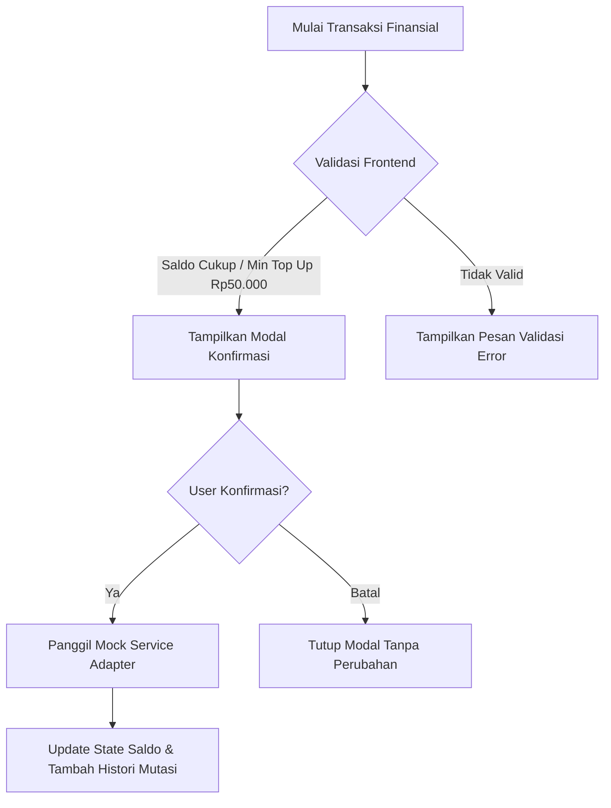

# Product Requirements Document (PRD)

## 1. Product Background & Problem Statement
Sekolah berasrama (*boarding school*) menghadapi friksi operasional finansial harian pada dua area utama:
1. **Penagihan & Pembayaran SPP**: Rekonsiliasi manual oleh Tata Usaha (TU), keterlambatan pembayaran orang tua akibat ketiadaan notifikasi/reminder otomatis, dan kurangnya transparansi arus kas pengeluaran sekolah.
2. **Transaksi Finansial Siswa (Kantin)**: Uang tunai fisik berisiko hilang/dicuri di lingkungan asrama, orang tua tidak dapat memantau uang saku harian anak, serta pengelola kantin kesulitan merekap pembukuan harian.

**Solusi**: Aplikasi web terpadu yang mendigitalisasi penagihan SPP (dengan status notifikasi WA & rekap pengeluaran) serta ekosistem kantin *cashless* berbasis saldo digital dan QR payment.

---

## 2. Target Personas & Role Matrix

| Role | Deskripsi & Backend Endpoint | Kebutuhan Utama | Batasan Akses |
| :--- | :--- | :--- | :--- |
| **Admin / Bendahara TU** (`admin`) | Pengurus keuangan sekolah (`/api/staff/belanja/*`, `/api/staff/me`) | Rekapitulasi SPP seluruh siswa, input & kelola buku pengeluaran sekolah, monitoring saldo & arus kas kantin global | Akses administratif penuh ke seluruh modul keuangan sekolah |
| **Staff Kantin / Kasir** (`canteen_staff`) | Petugas loket & kasir kantin (`/api/staff/save-money/*`) | Transaksi POS belanja santri (scan QR/nama), setor/top-up saldo santri di loket, riwayat transaksi kasir | Hanya modul POS kasir kantin, top-up saldo, dan mutasi santri |
| **Orang Tua / Wali** (`parent`) | Wali santri asrama | Melihat tagihan SPP anak, membayar SPP via gateway, top-up saldo saku anak, memantau riwayat pengeluaran santri | Hanya data anak/santri yang terhubung |
| **Siswa / Santri** (`student`) | Santri yang tinggal di asrama | Mengecek saldo kantin pribadi, menampilkan QR ID santri untuk discan di kasir | Hanya saldo & riwayat saku pribadi |

---

## 3. Functional Requirements

### 3.1. Modul Autentikasi & Otorisasi
- **FR-AUTH-01**: Multi-role login terintegrasi Backend Staff API (`POST /api/staff/login`): Admin TU, Staff Kantin, Orang Tua, dan Santri.
- **FR-AUTH-02**: Halaman login terpisah dari tampilan dashboard dengan proteksi token session.
- **FR-AUTH-03**: Auto-redirect ke dashboard spesifik role (`/admin`, `/canteen-staff`, `/parent`, `/student`) setelah otentikasi.
- **FR-AUTH-04**: Role guard pada setiap route halaman (`<ProtectedRoute allowedRoles={[...]} />`).

### 3.2. Modul SPP & Pengeluaran Sekolah
- **FR-SPP-01**: Dashboard status tagihan SPP (Status: `Lunas`, `Belum Bayar`, `Jatuh Tempo`).
- **FR-SPP-02**: Pembayaran SPP digital melalui simulasi Payment Gateway dengan modal konfirmasi.
- **FR-SPP-03**: Riwayat pembayaran SPP dengan filter bulan dan tahun ajaran.
- **FR-SPP-04**: Status notifikasi WhatsApp (*read-only*) untuk transparansi pengiriman reminder tagihan.
- **FR-SPP-05**: Manajemen Pengeluaran Sekolah (Khusus Admin/TU):
  - CRUD pencatatan pengeluaran (Nama pengeluaran, nominal, tanggal, kategori, keterangan/bukti).
  - Kategori standar: Operasional, Gaji, Sarana, Konsumsi, Lain-lain (*baseline assumption*).
  - Filter pengeluaran berdasarkan rentang tanggal dan kategori.

### 3.3. Modul Kantin Cashless
- **FR-KTN-01**: Tampilan saldo *cashless* real-time pada header/dashboard.
- **FR-KTN-02**: Top-up saldo kantin (Nominal minimal `Rp50.000`, opsi nominal cepat + input nominal kustom).
- **FR-KTN-03**: Histori mutasi saldo gabungan (Top-up dan transaksi belanja dalam satu linimasa dengan badge pembeda tipe transaksi).
- **FR-KTN-04**: Transaksi Kasir / QR Payment:
  - Tampilan QR/Barcode identitas siswa untuk discan di kasir kantin.
  - Simulasi scan & pembayaran instan dengan validasi kecukupan saldo.

### 3.4. Role-Based Views & Dashboard
- **FR-VIEW-01 (Orang Tua)**: Tab ringkasan anak, tagihan SPP aktif, tombol bayar SPP, saldo kantin anak, tombol top-up kantin, dan histori gabungan anak.
- **FR-VIEW-02 (Siswa)**: Kartu saldo kantin, QR Code pembayaran, riwayat jajan/transaksi harian.
- **FR-VIEW-03 (Admin/TU)**: Statistik total pemasukan SPP vs pengeluaran sekolah, daftar penunggak SPP, kelola buku pengeluaran, rekap omzet transaksi kantin.

### 3.5. Komponen Pendukung
- **FR-COM-01**: Modal konfirmasi sebelum eksekusi finansial (Bayar SPP, Top Up Saldo, Simpan Pengeluaran).
- **FR-COM-02**: Penanganan state terpadu: Loading skeleton/spinner, empty state dengan ilustrasi/pesan jelas, dan error handling banner.
- **FR-COM-03**: Dataset realistis (*seed mock data*) untuk keperluan demonstrasi interaktif.

---

## 4. Business Logic & Validation Rules

1. **Aturan Saldo**: Saldo kantin siswa tidak boleh bernilai negatif (`saldo >= 0`). Transaksi ditolak jika saldo tidak mencukupi.
2. **Aturan Top-up**: Minimal top-up adalah `Rp50.000`. Nilai di bawah threshold akan ditolak oleh validasi form.
3. **Modal Konfirmasi Wajib**: Tidak ada mutasi finansial yang dapat dieksekusi tanpa konfirmasi eksplisit dari pengguna.
4. **Isolasi Data Siswa**: Siswa dan Orang Tua hanya memiliki akses *read/write* terhadap entitas relasi milik mereka sendiri.

---

## 5. Known Facts, Assumptions & UNKNOWNs

### A. Known Facts (Fakta Pasti)
- Sistem berbasis frontend-only yang mengonsumsi REST API via JSON.
- Multi-role: Orang Tua, Siswa, Admin/TU.
- Fitur utama terbatas pada 4 modul: Auth, SPP & Pengeluaran, Kantin Cashless, Role-Based Views.
- Penulisan nominal rupiah dan tanggal menggunakan format standar Indonesia.

### B. Working Assumptions (Asumsi Kerja Sementara)
- Auth menggunakan skema token berbasis memori/mock credential untuk keperluan demo.
- Kategori pengeluaran sekolah mencakup: `Operasional`, `Gaji`, `Sarana`, `Konsumsi`, `Lain-lain`.
- Top-up saldo kantin disimulasikan melalui modal payment channel (Virtual Account / QRIS Mock).

### C. UNKNOWNs (Membutuhkan Konfirmasi Masa Depan)
- *[UNKNOWN-01]*: Mekanisme scanning kasir kantin di dunia nyata (apakah kasir memiliki antarmuka terpisah atau siswa yang scan QR statis stan kantin). Solusi saat ini: sediakan view QR Siswa + simulasi bayar cepat.
- *[UNKNOWN-02]*: Integrasi provider WhatsApp Gateway (e.g. Fonnte, Waba, Twilio) — saat ini UI menampilkan status *read-only* dari mock response.

---

## 6. Out of Scope (Batasan Eksternal)
- Pembangunan server backend / database SQL/NoSQL nyata.
- Integrasi SDK Payment Gateway riil di lingkungan production.
- Fitur akademik (nilai, presensi kelas, rapor siswa).
- Manajemen inventaris stok detail kantin (SKU/barcode fisik barang dagangan).
