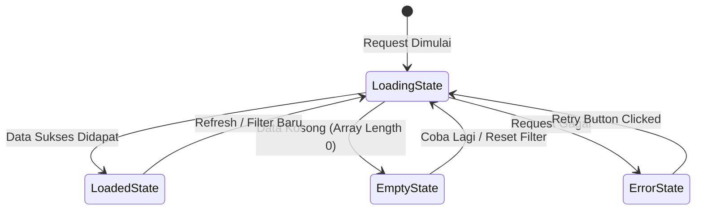

# UI & UX Guidelines (Design System)

Dokumen ini merupakan panduan tampilan, pola interaksi, dan sistem desain untuk antarmuka Portal Keuangan Sekolah.

---

## 1. Design Principles & Theme
- **Tone & Mood**: Profesional, bersih, terpercaya, modern (*fintech-school look*), dan mudah dipahami oleh orang tua di perangkat *smartphone*.
- **Mobile-First Approach**: Seluruh tata letak dioptimalkan terlebih dahulu untuk viewport mobile (360px–428px), lalu beradaptasi elegan ke tablet (768px) dan desktop (1024px+).
- **Aksesibilitas**: Kontras teks memenuhi standar WCAG AA; ukuran target sentuh (*touch target*) minimal `44px x 44px` pada tombol dan elemen interaktif.

---

## 2. Design Tokens & Color Palette

### 2.1. Color Tokens
| Token Name | Hex Code | Penggunaan |
| :--- | :--- | :--- |
| `--color-primary-600` | `#1E40AF` (Deep Blue) | Warna identitas utama, header, tombol primer aksi |
| `--color-primary-50` | `#EFF6FF` (Ice Blue) | Background highlight, badge aktif, card accent |
| `--color-secondary-600` | `#0D9488` (Teal) | Modul kantin, saldo, status transaksi positif |
| `--color-success-600` | `#16A34A` (Emerald) | Status lunas, top-up berhasil, pemasukan |
| `--color-danger-600` | `#DC2626` (Red) | Status jatuh tempo, pengeluaran, batalkan aksi, error |
| `--color-warning-600` | `#D97706` (Amber) | Status belum bayar, peringatan konfirmasi |
| `--color-neutral-900` | `#0F172A` (Slate Dark) | Teks utama, judul, angka nominal tebal |
| `--color-neutral-600` | `#475569` (Slate Muted) | Label sekunder, keterangan tanggal, subjudul |
| `--color-neutral-100` | `#F1F5F9` (Slate Light) | Background aplikasi, border pemisah lembut |
| `--color-white` | `#FFFFFF` | Permukaan kartu, background modal, input |

### 2.2. Typography
- **Font Family**: `Inter, system-ui, -apple-system, sans-serif`
- **Scale Hierarchy**:
  - `Display / Nominal Jumbo`: 24px–30px, Bold (700) -> Khusus kartu saldo / total tagihan
  - `Heading 1 / Page Title`: 20px–24px, SemiBold (600)
  - `Heading 2 / Section Title`: 16px–18px, SemiBold (600)
  - `Body / Normal`: 14px, Regular (400) & Medium (500)
  - `Caption / Meta`: 12px, Regular (400) -> Tanggal, status badge, label input

---

## 3. Reusable Component Specifications

### 3.1. Reusable Transaction Card (`TransactionCard`)
Komponen universal untuk menampilkan riwayat SPP maupun mutasi saldo kantin:
```
+-------------------------------------------------------------+
| [Icon Jenis]  Judul Transaksi                    +Nominal   |
|               Kategori / Info Tambahan           DD/MM/YYYY |
|               [Status Badge (Lunas/Top Up/Jajan)]           |
+-------------------------------------------------------------+
```
- **Props**: `title`, `subtitle`, `amount`, `type` (`in` / `out`), `date`, `status`, `tagColor`.
- Digunakan di: Histori SPP, Mutasi Kantin, dan Rekap Pengeluaran TU.

### 3.2. Financial Confirmation Modal (`ConfirmActionModal`)
Modal wajib sebelum eksekusi pembayaran SPP atau Top Up Saldo:
- **Komponen**: Judul modal, detail ringkasan transaksi (Rincian, Biaya, Metode), nominal tebal terformat Rupiah, tombol batal, tombol konfirmasi berwarna tegas.
- **Interaksi**: Animasi *fade-in/scale-up* halus, klik *backdrop* tidak boleh langsung mengeksekusi aksi.

### 3.3. Financial Stat / Balance Card (`BalanceStatCard`)
- Kartu utama di bagian atas dashboard dengan latar gradient lembut / aksen tegas.
- Memuat: Label ("Saldo Kantin", "Total Tagihan SPP"), Nilai Rupiah tebal, dan tombol aksi cepat (*Quick Action*: "Top Up", "Bayar Sekarang").

---

## 4. State Handling Patterns



1. **Loading State**: Gunakan skeleton placeholder dengan animasi shimmer lembut pada kartu dan tabel, hindari spinner layar penuh yang memblokir navigasi.
2. **Empty State**: Tampilkan icon relevan (misal `Wallet` atau `Receipt`), pesan informatif dalam bahasa Indonesia (e.g. *"Belum ada riwayat transaksi"*), dan tombol *Call to Action* jika relevan.
3. **Error State**: Tampilkan banner/kartu peringatan dengan tombol "Coba Lagi" (*retry button*).

---

## 5. Form & Interaction Rules
- **Input Nominal Uang**: Memiliki prefix tetap `Rp` di sisi kiri input dan formatting ribuan otomatis saat mengetik.
- **Quick Amount Selector**: Tombol pilihan cepat pada form top-up (`Rp50.000`, `Rp100.000`, `Rp200.000`, `Rp500.000`).
- **Feedback Langsung**: Tampilkan status validasi inline di bawah input (e.g., *"Minimal top-up Rp50.000"* berwarna merah).
- **Toast Notifications**: Notifikasi popup mengambang di pojok atas (mobile: atas tengah) untuk konfirmasi sukses / gagal transaksi yang otomatis hilang dalam 3-4 detik.
